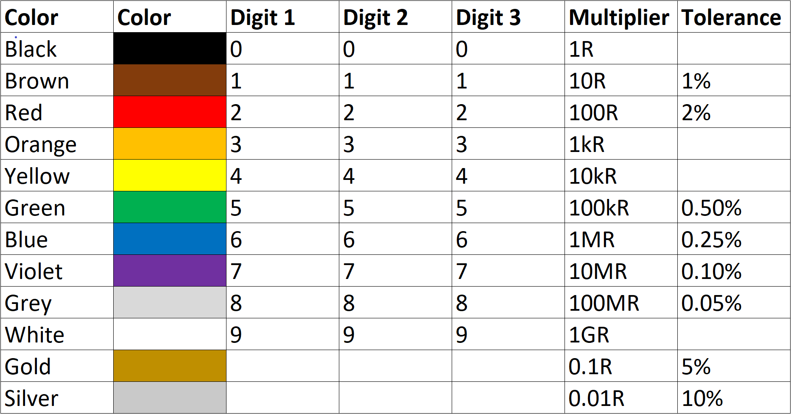

# Resistor_Generator
Repository containing scripts for automatically generating THT resistors with
color codes. Resistors with 4 and 5 color bands are being supported.

## Dependencies
This code is dependent on some python modules. Execute following commands to
download the modules:

    pip install pypng

## Tool configuration
The following software versions were used to develop this software:

* VSCode: v1.66.2
* Python: v3.10.4

Versions of python modules:
* pypng: v0.0.21

## Capabilities
Resistor with 4 color bands:

| Band | Function   |
|:-----|:-----------|
| 1    | Digit 1    |
| 2    | Digit 2    |
| 3    | Multiplier |
| 4    | Tolerance  |

Resistor with 5 color bands:

| Band | Function   |
|:-----|:-----------|
| 1    | Digit 1    |
| 2    | Digit 2    |
| 3    | Digit 3    |
| 4    | Multiplier |
| 5    | Tolerance  |

Resistor color coding which is used by this generator:

